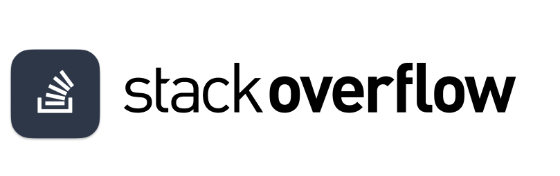
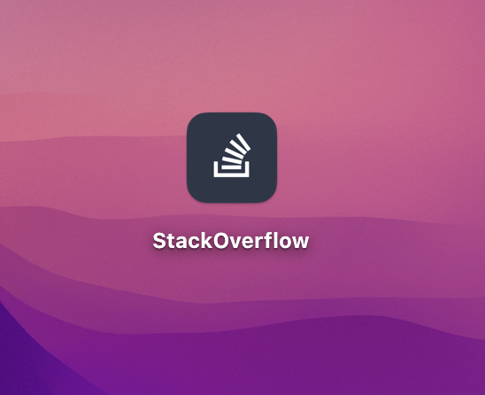

## StackOverflow desktop app (MacOS, Windows, Linux)

**IMPORTANT:** This app is under development. This is a hobby project so no deadlines, no commercial.

- Fast, clean, and distraction-free UI
- Better wysiwyg editor
- Native notifications
- Cross-platform
- and more...

**Technology stack:**
- Electron
- React + TypeScript
- mobx-state-tree
- ChakraUI

**Stay tuned:**
- Please, upvote a post on [StackApps](https://stackapps.com/questions/9223)
- https://www.twitch.tv/jott1

**Interesting to test this app?**
- Ping me here [maxdiachenko.com](https://maxdiachenko.com)

## Some screens (11 May, 2022)

[![enter image description here][1]][1]
App launching

[![enter image description here][2]][2]
Question details screen

[![enter image description here][3]][3]
Question details screen 2

[![enter image description here][4]][4]
Bountied questions screen

[![enter image description here][5]][5]
Profile screen

[![enter image description here][6]][6]
My tags screen

[![enter image description here][7]][7]
All tags screen

[![enter image description here][8]][8]
Dropdowns

[1]: assets/screenshots/Loading.gif
[2]: assets/screenshots/Question%20details.gif
[3]: assets/screenshots/Question%20details%202.gif
[4]: assets/screenshots/Bountied.gif
[5]: assets/screenshots/Profile.gif
[6]: assets/screenshots/My%20tags.gif
[7]: assets/screenshots/Tags.gif
[8]: assets/screenshots/Dropdowns.gif
[9]: assets/screenshots/App%20Icon.png

### MacOS
TBD

### Windows
TBD

### Linux
TBD
